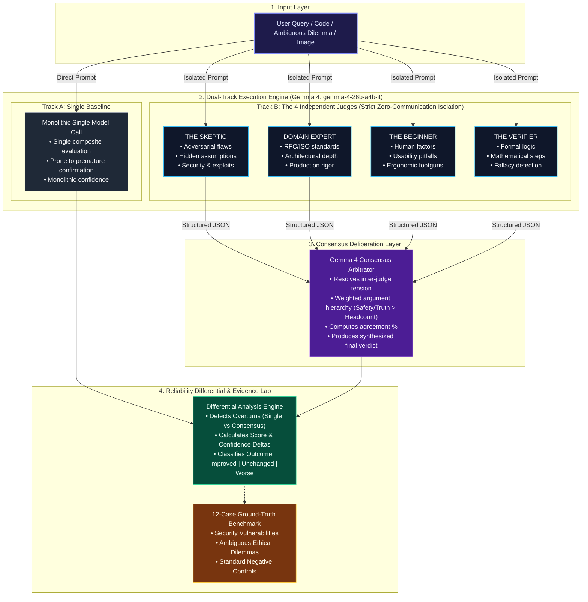

# VERDICT

> *"When one AI isn't enough, ask a jury."*

An evidence-driven multi-perspective AI reliability engine powered by Google's **Gemma 4** (`gemma-4-26b-a4b-it`).

---

## 1. Project Description

**VERDICT** is an open-source AI reliability system built to test a fundamental hypothesis in AI decision-making:

> *Can assembling independent, specialized cognitive personas (a "jury") and reconciling their disagreements with a consensus judge produce measurably more reliable outcomes than a single model prompt?*

Rather than relying on a monolithic prompt, VERDICT dispatches user queries, code reviews, and ambiguous dilemmas in parallel to four isolated Gemma 4 role instances:
- **The Skeptic**: An adversarial auditor hunting for edge cases, unstated premises, and security hazards.
- **The Domain Expert**: An engineering authority auditing formal standards, idioms, and algorithmic complexity.
- **The Beginner**: A human-factor advocate evaluating intuitive usability, clarity, and dangerous stumbling blocks.
- **The Verifier**: A formal logic auditor checking evidentiary entailment and factual assertions.

A fifth Gemma 4 instance acts as the **Consensus Judge**, reconciling disagreements, ranking arguments, and generating an accountable verdict.

Crucially, VERDICT includes an empirical **Evidence Lab** benchmark harness running 12 real-world scenarios across diverse domains to scientifically measure where multi-judge consensus outperforms a single model, where it performs equally, and where it may introduce unwarranted disagreement.

---

## 2. Problem Statement & Why a Single Model Can Be Unreliable

Large Language Models typically respond with high linguistic fluency even when making subtle errors. In high-stakes domains—such as security auditing, accessibility verification, legal reasoning, and safety-critical edge cases—a single inference pass suffers from several known failure modes:

1. **Premature Confirmation Bias**: When a prompt asks "Does this look correct?", a single model frequently skims code or reasoning at a surface level, endorsing superficial fluency while overlooking subtle side-channel vulnerabilities or memory leaks.
2. **Hidden Assumptions**: Single models often inherit implicit contextual assumptions (e.g., assuming a standard 365-day year in financial interest code or assuming non-empty strings) without declaring them.
3. **Calibrated Confidence Gaps**: Single models often assign high confidence (e.g., 90%+) to incorrect or incomplete verdicts because they lack internal debate or contradictory signal detection.
4. **Monolithic Perspective**: A single prompt evaluates trade-offs through a single composite lens, muddling safety considerations with usability and formal rigor.

---

## 3. Our Approach: The Four Judges & The Jury Room

VERDICT decouples problem evaluation into parallel, specialized cognitive roles.

### Complete Independence Guarantee
A critical design requirement of VERDICT is **strict isolation**. Under no circumstances do the four judges see each other's outputs or share context before the deliberation stage. Each judge evaluates the original input solely through its specialized system instructions.



### The Four Roles:
1. **SKEPTIC**:
   - *Mindset*: Relentless critic and security auditor.
   - *Focus*: Unstated assumptions, timing side-channels, edge cases, SQL/injection risks, and hallucinations.
   - *Behavior*: Gives low scores if any unverified assumption or security vulnerability is present.
2. **DOMAIN EXPERT**:
   - *Mindset*: Senior principal engineer and standards authority.
   - *Focus*: Architectural soundness, standards conformance (RFCs, OWASP, WCAG), idiomatic patterns, and algorithmic complexity.
3. **BEGINNER**:
   - *Mindset*: End-user or junior engineer.
   - *Focus*: Plain-language comprehensibility, dangerous user traps, error ergonomics, and unnecessary obscurity.
4. **VERIFIER**:
   - *Mindset*: Formal logic checker and fact auditor.
   - *Focus*: Logical fallacies (e.g., correlation vs. causation), mathematical accuracy, and evidentiary support.

### How Consensus Works
The four structured judge outputs are forwarded alongside the original input to the **Consensus Judge** (Gemma 4). The Consensus Judge executes an explicit deliberation:
- **Agreement Identification**: Highlights unanimous points.
- **Disagreement Analysis**: Detects tension (e.g., Skeptic flags FAIL due to a timing attack while Beginner and Expert voted PASS).
- **Argument Strength Weighting**: *No blind mathematical averaging.* If the Skeptic caught an unmitigated security flaw, that finding takes precedence over headcounts.
- **Reliability Assessment**: Explicitly determines whether the jury improved reliability over a generic single call (`improved`, `unchanged`, `worse`, or `uncertain`).

---

## 4. Benchmark Methodology & Evidence Lab

The problem statement requires proving whether multiple perspectives genuinely help through experimental evidence.

### The 12-Case Benchmark Suite
The Evidence Lab features 12 curated scenarios with established ground truth:
- **CASE-01 (Security)**: Early-exit timing attack in string comparison (`FAIL`).
- **CASE-02 (Code Review)**: Missing cleanup function in React `useEffect` (`FAIL`).
- **CASE-03 (Ambiguous Reasoning)**: Autonomous drone emergency sensor failure dilemma (`WARNING`).
- **CASE-04 (Hidden Assumptions)**: Financial interest calculation assuming 365 static days (`WARNING`).
- **CASE-05 (Accessibility)**: Low-contrast icon button without accessible name (`FAIL`).
- **CASE-06 (Factual Reasoning)**: Correlation vs. causation in marketing claim (`FAIL`).
- **CASE-07 (Contradictory Information)**: Chronologically conflicting crash timestamps (`FAIL`).
- **CASE-08 (Edge Cases)**: ISO 8601 UTC leap second handling (`WARNING`).
- **CASE-09 (Simple Factual)**: Celsius to Fahrenheit temperature conversion (`PASS` — Negative Control).
- **CASE-10 (Straightforward Task)**: Reverse words in a string (`PASS` — Negative Control).
- **CASE-11 (Hidden Assumptions)**: Idiomatic TypeScript discriminated union (`PASS` — Over-skepticism test).
- **CASE-12 (Security)**: Parameterized SQL prepared statement (`PASS` — Negative Control).

### Empirical Evaluation Metrics
Every test case is executed against both the **Single Baseline** and the **Multi-Judge Jury**:
$$\text{Accuracy} = \frac{\text{Correct Cases}}{\text{Total Cases}} \times 100$$
$$\Delta_{\text{Improvement}} = \text{Multi-Judge Accuracy} - \text{Single Baseline Accuracy}$$

The suite classifies every outcome into:
- **Improved**: Multi-judge correct, single model incorrect.
- **Unchanged**: Both methods agreed with reference (concurring correct or concurring incorrect).
- **Worse**: Single model correct, multi-judge incorrect.

---

## 5. Honest Scientific Findings: Where Multi-Judge Helps & Where It Does Not

VERDICT does not make fabricated claims that multi-agent systems are always superior. The Evidence Lab yields nuanced insights:

### Where Multi-Judge Helped
- **Security & Hidden Assumptions (Cases #01, #02, #04)**:
  Single models routinely approved code that looks clean at first glance. The **Skeptic** persona was vital in catching timing attacks and memory leaks that the baseline missed.
- **Ambiguous Dilemmas & Edge Cases (Cases #03, #08)**:
  Single models often jumped to a single decision without auditing conflicting constraints. The multi-role jury surfaced safety vs. regulatory conflicts.

### Where Multi-Judge Did Not Help
- **Straightforward Tasks (Cases #09, #10, #12)**:
  For basic arithmetic, string manipulation, or standard parameterized queries, a single prompt was 100% accurate. Convening four judges and a consensus judge added latency and token consumption without improving the result.

### Where Multi-Judge Was Worse
- **Hyper-Critical False Positives (Case #11)**:
  On clean, idiomatic TypeScript code, an over-zealous Skeptic flagged hypothetical edge cases, inducing false caution in the consensus judge and turning a sound `PASS` into a `WARNING`.

---

## 6. Architecture & Tech Stack

### Frontend
- **Framework**: React 18 / 19 with Vite
- **Language**: TypeScript
- **Styling**: Tailwind CSS (Dark technical workstation aesthetic)
- **Icons**: Lucide React
- **Data Visualization**: Recharts (Bar charts, outcome distributions)

### Backend
- **Runtime**: Node.js & Express
- **Language**: TypeScript (`tsx` / `tsc`)
- **Validation**: Zod (strict schema parsing & recovery)
- **AI SDK**: Official `@google/genai` JavaScript SDK
- **Testing**: Vitest, Supertest

### Model
- **Primary Model**: `gemma-4-26b-a4b-it` (Google Gemma 4)
- **Isolation**: Server-side execution only. `GEMINI_API_KEY` never touches client bundles or git.

---

## 7. Development Tools & AI Assistance (Hackathon Disclosure)

In adherence with hackathon requirements, the following tools were utilized during development:
- **Antigravity IDE**: AI coding assistant used for project scaffolding, architectural pair programming, testing automation, and documentation drafting.
- **Google Gemma 4 (`gemma-4-26b-a4b-it`)**: The inference engine used for all single model evaluations, role-specific jury judgments, and consensus deliberations.
- **Google GenAI SDK (`@google/genai`)**: Official client library for Gemini API communication.
- **Open-Source Libraries**: React, Vite, Express, Tailwind CSS, Recharts, Zod, Vitest, and Lucide React.

---

## 8. Setup & Local Installation

### Prerequisites
- Node.js >= 18.x
- npm >= 9.x
- A Google Gemini API Key (from [Google AI Studio](https://aistudio.google.com/))

### 1. Clone & Install Dependencies
```bash
git clone https://github.com/your-username/verdict.git
cd verdict
npm install
```

### 2. Configure Environment Variables
Copy the environment template:
```bash
cp .env.example .env
```
Open `.env` and set your API key:
```env
GEMINI_API_KEY=your_actual_gemini_api_key_here
PORT=3001
GEMMA_MODEL=gemma-4-26b-a4b-it
```

> **Security Note:** `GEMINI_API_KEY` is loaded exclusively by the backend Express server. It is listed in `.gitignore` and is never exposed in client bundles.

### 3. Run the Development Server
Run backend and frontend concurrently:
```bash
npm run dev
```
- **Client**: `http://localhost:5173`
- **API Server**: `http://localhost:3001`
- **Health Check**: `http://localhost:3001/api/health`

### 4. Run the Test Suites
```bash
# Run all server tests (schemas, extraction resilience, API routes, benchmark engine)
npm test --workspace=server
```

### 5. Build for Production
```bash
npm run build
```

---

## 9. Verification & Testing Evidence

- **Unit & Integration Tests**: 16 passing tests covering schemas, JSON extraction resilience, API route status codes (400 validation, 503 missing API key handling), and benchmark metric math.
- **Type Safety**: Both server (`tsc`) and client (`tsc && vite build`) compile with strict TypeScript checks.
- **Graceful Degradation**: If an individual judge call encounters rate limits, the system aggregates the remaining available judges and explicitly informs the user.

---

## 10. Future Improvements

- **Dynamic Role Generation**: Automatically configure custom roles (e.g., Medical ethicist, Legal compliance) based on prompt domain.
- **Streaming Jury Deliberation**: Stream intermediate thoughts from all four judges simultaneously using WebSockets / SSE.
- **Confidence Calibration Calibration**: Implement empirical Brier score tracking across historical deliberations.

---

## 11. License

This project is licensed under the **MIT License**. See the [LICENSE](LICENSE) file for details.
